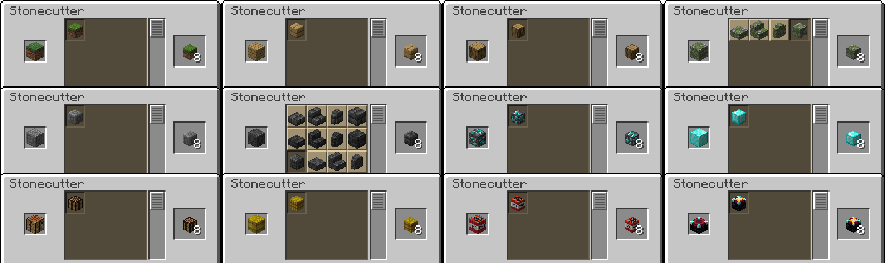

# MicroCutting

This mod adds recipes to the stonecutter to craft microblocks inside the stonecutter.
By putting a grass block into the stonecutter, you can craft eight playerheads with the grass block texture.

## Preview

Credits:
* All custom heads are fetched from the [vanillatweaks wandering trader datapack](https://vanillatweaks.net/picker/datapacks/).
* The recipes added with [orangemonkey68/injectable-recipes](https://github.com/orangemonkey68/injectable-recipes)
