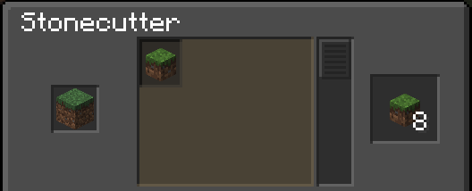

# micro-cutting

Small mod that adds stonecutter recipes to craft 8 microblocks from a block. A microblock is a player head with a block texture.
All textures are fetched from the [vanillatweaks wandering trader datapack](https://vanillatweaks.net/picker/datapacks/).
Recipes added with [orangemonkey68/injectable-recipes](https://github.com/orangemonkey68/injectable-recipes)

## Preview

